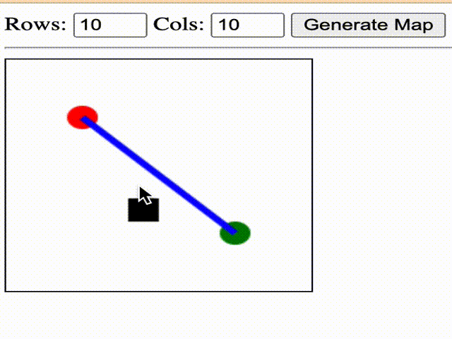

# D* Pathfinding Interactive Simulator

---

## Intelligent Agent Design - Objective 
> Given a 5m x 5m target area. Write and implement the D* Pathfining algorithm for a quadrotor UAV so that it can navigate obstacles and arrive to its intended target zone. The user may toggle wall/floor cells.

--- 

## Motivation - Considerations

D* Pathfinding is an efficient algorithm for finding the shortest path in dynamic environments compared to other pathfinding algorithms like A* and Dijkstra's algorithm. In dynamic environments, obstacles can move, new obstacles can be added, and the optimal path can change frequently. D* Pathfinding takes into account these changes and dynamically updates the path as the environment changes. D* Pathfinding can handle incomplete knowledge of the environment, making it more robust in uncertain environments. This makes it suitable for real-time applications like robotics and autonomous vehicles, where the environment is constantly changing and the path needs to be quickly updated. 

---
## Approach - Interactive in Realtime

The D* algorithm finds the shortest path between two points in a grid-like environment, while allowing for dynamic changes to the environment during the search process. It does this by incrementally updating a map of the environment as it explores it, and using this map to guide its search. The D* algorithm is efficient and reliable, and is widely used in many real-world applications. The D* Pathfinding Interactive Simulator provides an interactive way to explore and experiment with this algorithm.

---
## Key Features

The D* Pathfinding Interactive Simulator is an implementation of the D* Lite algorithm for pathfinding in a grid-based environment with obstacles.

The main algorithmic overview can be described as follows:

 - *Initialization:* The sysCall_init() function initializes the simulation environment, including creating the grid cells and adding the start and goal objects.

- *Planning:* The sysCall_actuation() function is called at each simulation step. It uses the D* Lite algorithm to find the shortest path from the start to the goal while avoiding obstacles. The algorithm uses the SafeMap class to represent the environment and the Dstar class to perform the search.

- *Following the Path:* Once the path is calculated, the follow_path() function is called to move the drone along the calculated path. The function calculates the direction and distance between the current and target positions, and moves the drone towards the target position until it reaches it.

- *User Interaction:* The simulator allows for user interaction through keyboard and mouse clicks. The handle_key_press() fun

## Algorithmic Overview - Methods

This code is a simulation of a quadcopter navigating a grid-based environment using the D* Lite algorithm. The quadcopter is represented by a model file loaded into the simulation, and its position is updated using a follow_path() function that moves the quadcopter to the next position in the path calculated by D* Lite.

The grid-based environment is created using add_grid_cell() and init_grid() functions. The environment is initialized with a start and goal object using add_start_object() and add_goal_object() functions, respectively. If the quadcopter reaches the goal object, the goal object is randomized to a new position using randomize_goal().

The D* Lite algorithm is implemented in the sysCall_actuation() function, where the map of the environment is created using SafeMap() and the start and goal states are obtained using get_endpoints(). The D* Lite algorithm is then run using the run() method of the Dstar class.

---

## API Documentation

📚 **[API - Python + CoppeliaSim](api.md)**

---

## CoppeliaSim Simulation for Stochastic Patrol Plan

---

## JavaScript Demo for Stochastic Patrol Plan

